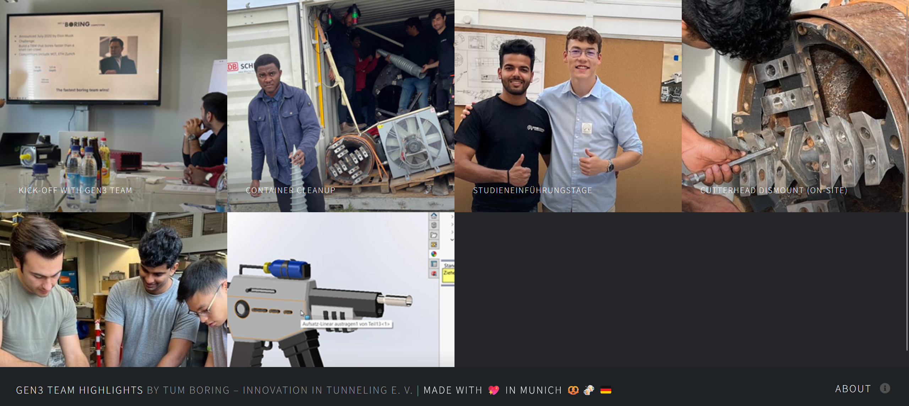

# [TUM Boring Gen3 Team Highlights](https://tum-boring.github.io/gen3.tum-boring.com/)
> Say hello to TUM Boring's Gen3 website. A slick, one-page gallery design with a fully functional lightbox.

## Credits
- Website coded by [Suriyaa](https://about.suriyaa.tk)
- Design by [aj](https://twitter.com/ajlkn)
- Icons by [Font Awesome](fontawesome.io)
- Demo Images by [Unsplash](unsplash.com)
- jQuery.js by [jQuery](jquery.com)
- Poptrox  by [aj](github.com/ajlkn/jquery.poptrox)
- Responsive Tools by [aj](github.com/ajlkn/responsive-tools)
- Website's code hosted on [GitHub](https://www.github.com/)
- Deployed public website hosted on [GitHub Pages](https://pages.github.com/)

## License
Free for personal and commercial use under the CCA 3.0 license (html5up.net/license)
